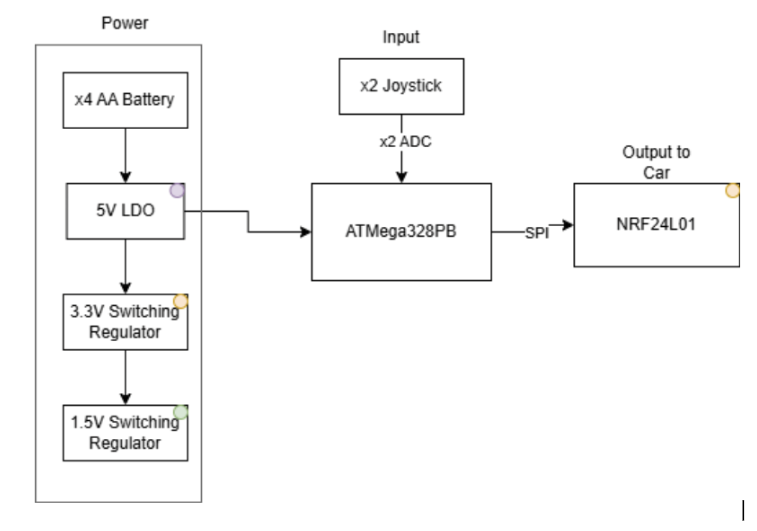
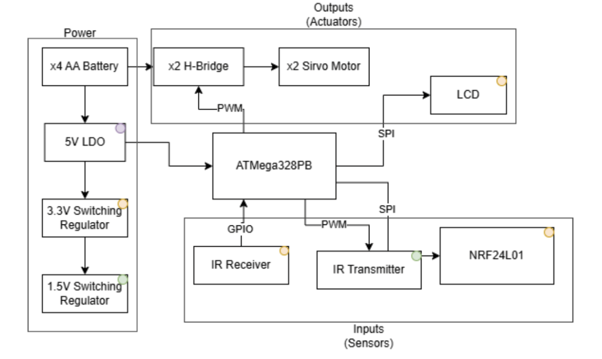
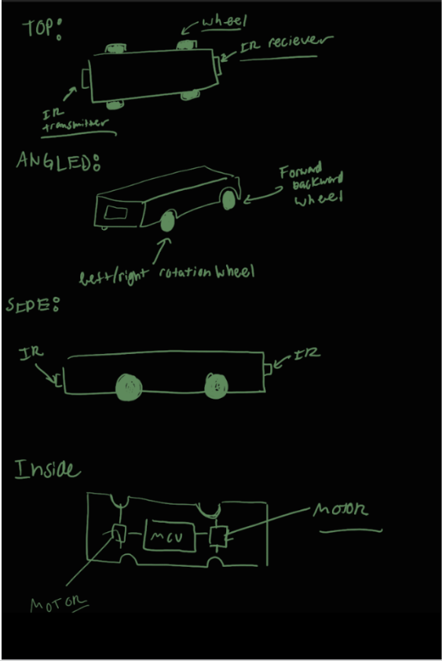

# Final Project

**Team Number:17**

**Team Name: RC Car Game**

| Team Member Name | Email Address       |
|------------------|---------------------|
| David Aquino   | aquinod@seas.upenn.edu |
| Alexander Freeman| alfre@seas.upenn.edu|
| Lucas Krippendorff| lukr@seas.upenn.edu|
| Anil Ghosh| atghosh@seas.upenn.edu|

**GitHub Repository URL: https://github.com/upenn-embedded/final-project-s26-t17#** 

**GitHub Pages Website URL:** [for final submission]*

## Final Project Proposal

### 1. Abstract
Our project is a 2-player game of “tag” with RC cars. Each player is given a controller to control their vehicle, with one player starting as the chaser and one starting as the runner. If the chaser is able to bump/tag the runner, then the roles reverse after a 5 second cool down period. Roles will be indicated by the LCD screen on the top of the car. The game will end after a certain amount of time has elapsed and the current chaser will be crowned the winner. 

### 2. Motivation
The primary motive of the game is for the function of entertainment. A standout feature of this game will be the collision detection and role switching between the two vehicles. On top of this, SPI communication between the MCU and LCD in conjunction with the wireless communication between the controller and cars MCU are other notable features that will require technical exploration and thought. Ultimately, the game itself will not only be fun, but the technical breadth required to realize the project will also provide us with a unique set of engineering problems to solve (and learn from).

### 3. System Block Diagram

controller diagram: 

car diagram: 

### 4. Design Sketches

### 5. Software Requirements Specification (SRS)

**5.1 Definitions, Abbreviations**

Here, you will define any special terms, acronyms, or abbreviations you plan to use for hardware

**5.2 Functionality**

| SRS-01 |                       Remote Drive Response: The vehicle shall respond to valid remote control drive commands within 100 ms of transmission, including forward, reverse, left, right, and stop commands. Validation: Timestamp controller transmission and observed motor actuation using serial logs and/or video frame analysis.                       |
|--------|:--------------------------------------------------------------------------------------------------------------------------------------------------------------------------------------------------------------------------------------------------------------------------------------------------------------------------------------------------------:|
| SRS-02 |                             Continuous Motor and Steering Control: The firmware shall update motor speed and steering control signals at a rate of at least 20 Hz during active vehicle operation. Validation: Measure PWM/control signal update timing with an oscilloscope or logic analyzer while the car is being driven.                            |
| SRS-03 | IR Tag Detection: The system shall detect a valid IR tag event when the rear-mounted IR receiver detects a modulated IR signal from the opposing vehicle for a minimum number of consecutive samples. Validation: Perform controlled alignment tests and verify that valid IR transmissions consistently trigger detection while ambient light does not. |
| SRS-04 |      Tag Validation and Cooldown Logic: The system shall confirm a tag event only after satisfying a defined detection condition and shall enforce a cooldown period of at least 1 second during which additional tags are ignored. Validation: Simulate repeated IR exposure and verify that only valid, non-overlapping tag events are registered.     |
| SRS-05 |       Role Switching via Wireless Communication: Upon detection of a valid tag event, the system shall transmit a role-switch message and update the chaser/runner roles on both vehicles within 200 ms. Validation: Trigger tag events and verify synchronized role updates on both cars using debug logs and observed IR transmitter activation.       |
| SRS-06 |                    Directional Tagging Behavior: The system shall only register a tag when the chaser’s front-mounted IR transmitter aligns with the runner’s rear-mounted receiver. Validation: Test various orientations between vehicles and confirm that tags are only registered when the chaser is positioned behind the runner.                   |
| SRS-07 |                                                                Game State Feedback: The system shall provide real-time visual feedback indicating the current role (chaser or runner) and tag events. Validation: Trigger role changes and tag events and verify correct display outputs.                                                                |

### 6. Hardware Requirements Specification (HRS)

**6.1 Definitions, Abbreviations**

Here, you will define any special terms, acronyms, or abbreviations you plan to use for hardware

**6.2 Functionality**

| HRS-01 |     Drive Motor Actuation: The vehicle shall include a motor drive subsystem capable of driving the car forward and reverse across a flat indoor surface under onboard power. Validation: Test the car on a flat surface and verify successful forward and reverse motion over a fixed distance.     |
|--------|:----------------------------------------------------------------------------------------------------------------------------------------------------------------------------------------------------------------------------------------------------------------------------------------------------:|
| HRS-02 |           Steering Mechanism: The vehicle shall include a steering mechanism that enables controlled left and right turning during remote operation. Validation: Command left and right turns and verify directional change through observed turning maneuvers or measured turning radius.           |
| HRS-03 |                  IR Transmission Subsystem: Each vehicle shall include a forward-facing IR transmitter driven by a PWM signal (~38 kHz) to emit a detectable signal for tagging. Validation: Verify IR emission using an IR receiver module or camera and confirm proper modulation.                 |
| HRS-04 |     IR Reception Subsystem: Each vehicle shall include a rear-mounted IR receiver module capable of detecting modulated IR signals from the opposing vehicle. Validation: Confirm reliable detection of transmitted IR signals at distances up to the specified gameplay range of ~6 -10 inches.     |
| HRS-05 | Wireless Communication Interface: Each vehicle shall include a wireless transceiver (nRF24L01) interfaced via SPI to enable communication with its controller and the opposing vehicle. Validation: Verify bidirectional communication by transmitting and receiving control and game-state packets. |
| HRS-06 |                                                  Status Feedback Hardware: Each vehicle shall include an LCD Display to communicate role status and tag events to the user. Validation: Trigger system states and verify correct activation of LCD.                                                  |
| HRS-07 |   Regulated Power Distribution: Each vehicle shall include a power subsystem that provides regulated voltage levels for logic components (MCU, sensors, RF module) and motor actuation components. Validation: Measure voltage levels under idle and active conditions and verify stable operation.  |

### 7. Bill of Materials (BOM)

[Visit BOM](https://docs.google.com/spreadsheets/d/1tswUpjjSOV8vyMNagtu2i6aR_z83_FL3piSMzd2DsaQ/edit?usp=sharing)

Remote:
STM nucleo
NRF24L01 transceiver module
Thumbstick potentiometer (x2)
Start/reset button
7-segment or small numeric display (timer readout)
AA battery pack + holder

Car:
STM nucleo
NRF24L01 transceiver module
Mecanum wheel chassis
DC gear motor
Steering Servo Motor
H-bridge motor driver (x2)
LEDs (x2)
AA battery pack + holder

### 8. Final Demo Goals
On demo day, the project will be demonstrated using two small RC cars operating on the floor in an open indoor space such as a classroom or lab area. One car will act as the chaser and the other as the runner. Each vehicle will be controlled by a player using its control interface. During the demonstration, the runner will attempt to avoid the chaser while moving around the designated area, while the chaser will attempt to approach the runner and trigger a tag event by entering a predefined proximity range. When the tag condition is met, the runner vehicle will automatically enter a disabled state where its motors stop and a visual or audible indicator (such as an LED or buzzer) signals the tag event. The demonstration will require approximately 2–3 meters of open floor space and will last about one to two minutes, allowing time to show vehicle movement, proximity detection, and the tag response. The cars will be powered by onboard batteries and will include a reset mechanism so the demonstration can be quickly repeated if needed. This setup highlights the integration of sensing, motor control, and embedded game logic within the system.

### 9. Sprint Planning

| Milestone  | Functionality Achieved | Distribution of Work |
| ---------- | ---------------------- | -------------------- |
| Sprint #1  |    Basic joystick reading and detailed schematics     |    Schematics, software, testing, prototyping    |
| Sprint #2  |    Motor control and SPI    |    Software, component testing    |
| MVP Demo   |    One semi-driving car with functional controller    |    Power management, software, testing    |
| Final Demo |    Two functional driving cars and controller pairs, IR sensing, LCD display    |    Power management, weight/wire reduction, software    |

**This is the end of the Project Proposal section. The remaining sections will be filled out based on the milestone schedule.**

## Sprint Review #1

### Last week's progress

This week we decided to switch boards to STM32. We were able to read 2-joysticks inputs using the ADC's on the board. This required us to write a simple ADC driver. We also wrote an untested SPI driver to general SPI communication. Additionally we designed a more detailed schematic. (please see Code folder and Images folder)

### Current state of project
Currently we are reading the joystick values correctly. Additionally, we have an SPI driver. We also have the parts ordered.

### Next week's plan
By next week, we wish to have all modular moving parts working seperatly. This means ADC driver, SPI communication for LCD AND NRF module, IR sensing, and motors being driven via PWM. These are all the "moving" parts of the project.

## Sprint Review #2

### Last week's progress
This week, the primay points of progress where the completion of many of the sub-processess working individually. Namely, we have a 2-joysticks that can independently control two motors (wireless communication is still WIP). Additionally, we have a working SPI driver and libraries for LCD screen display, and IMU read. Please refer to the Code/Libraries(WIP) folder to see all of the driver and library code. Also see below for some images and demos. 

### Current state of project
Currently Reading various IMU input via SPI driver + Custom IMU Library Code: 
[Click here](https://drive.google.com/file/d/1JL8hYtsbjdTGgINUwH7gA-cYNsOINLV4/view?usp=sharing)

Video of Motors being independently and simutaneously controlled via joystick while LCD screen displays simple image: 
[Click here](https://drive.google.com/file/d/1q-dIAWgbDD3BVFPxORT9Md2qz9mlJeNM/view?usp=sharing)

Hardware Diagram: 

### Next week's plan
For next week, we must complete wireless communication and also have a fully working car that can move and respoind to joystick input. 

## MVP Demo

## Final Report

Don't forget to make the GitHub pages public website!
If you’ve never made a GitHub pages website before, you can follow this webpage (though, substitute your final project repository for the GitHub username one in the quickstart guide):  [https://docs.github.com/en/pages/quickstart](https://docs.github.com/en/pages/quickstart)

### 1. Video

### 2. Images

### 3. Results

#### 3.1 Software Requirements Specification (SRS) Results

| ID     | Description                                                                                               | Validation Outcome                                                                          |
| ------ | --------------------------------------------------------------------------------------------------------- | ------------------------------------------------------------------------------------------- |
| SRS-01 | The IMU 3-axis acceleration will be measured with 16-bit depth every 100 milliseconds +/-10 milliseconds. | Confirmed, logged output from the MCU is saved to "validation" folder in GitHub repository. |

#### 3.2 Hardware Requirements Specification (HRS) Results

| ID     | Description                                                                                                                        | Validation Outcome                                                                                                      |
| ------ | ---------------------------------------------------------------------------------------------------------------------------------- | ----------------------------------------------------------------------------------------------------------------------- |
| HRS-01 | A distance sensor shall be used for obstacle detection. The sensor shall detect obstacles at a maximum distance of at least 10 cm. | Confirmed, sensed obstacles up to 15cm. Video in "validation" folder, shows tape measure and logged output to terminal. |
|        |                                                                                                                                    |                                                                                                                         |

### 4. Conclusion

## References

